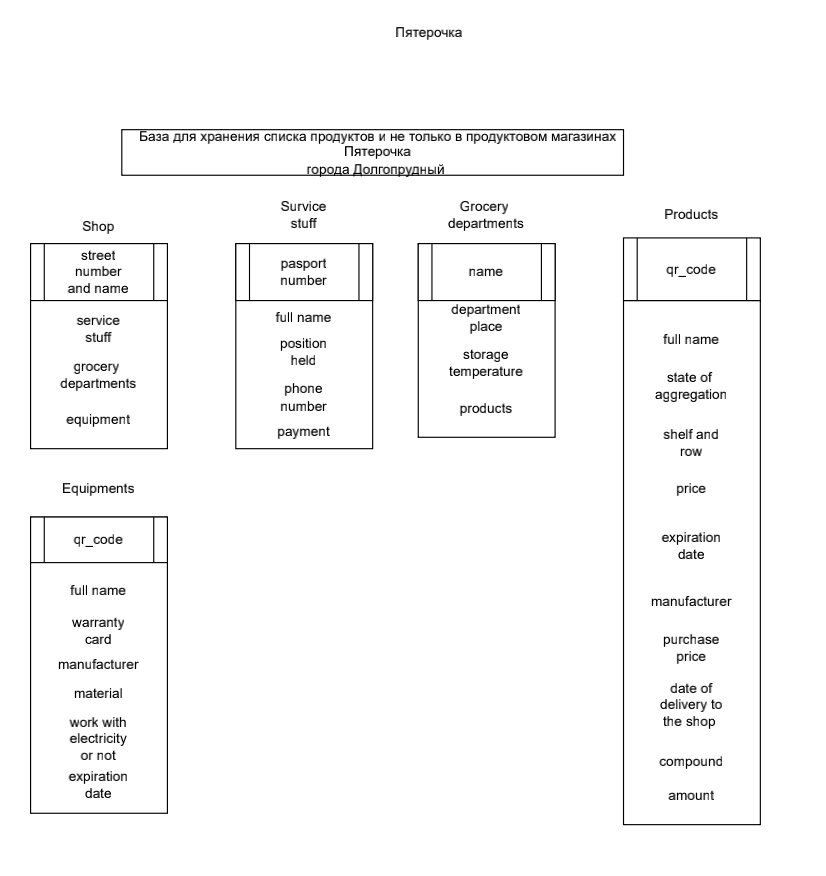

Для начала хочу показать свои таблицы, а потом рассказать их особенности:

У меня 5 таблиц, они связаны между собой и для 4 из них есть соответственно различные тригеры, процедуры и индексы для комфортной работы:
1)Таблица shop содержит общую информацию о магазине, PK в этой таблице является id, FK в этой таблице: stuff_id, grocery_departments_id, equipment_id.

2)Таблица equipments содержит информацию об оборудовании магазина, соответсвенно id (PK) полная копия equipment_id(FK) таблицы shop, Я создал View, чтобы недоброжелательные пользователи не могли посмотреть полной информации об оборудовании.

3)Таблица stuff содержит информацию о сотрудниках магазина, соответсвенно id (PK) полная копия stuff_id(FK) таблицы shop.
View для таблицы stuff скрывает личные  данные, такие как passport_number и phone.Trigger для stuff мешает созданию элемента таблицы с отрицательной зарплатой.Также для быстрого нахождения элемента этой таблицы я написал Index по имени.

4)Таблица grocery_departments содержит информацию о продуктовых отделах магазина, соответсвенно id (PK) полная копия grocery_department_id(FK) таблицы shop, эта таблица как бы является дополнением до таблицы products.

5)Таблица products связана с grocery_departments, id(PK) является копией grocery_departments.id (PK, FK)Index создан для быстрой сортировки в порядке убывания. Trigger проверяет значение цены. 2 процедуры для этой таблицы.

Визуализация этих особенностей вот здесь:
https://disk.yandex.ru/d/TRl8NoRkAN7ldA
